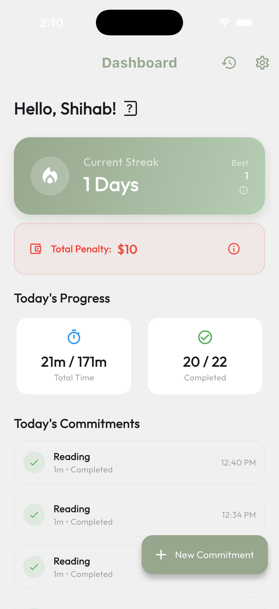
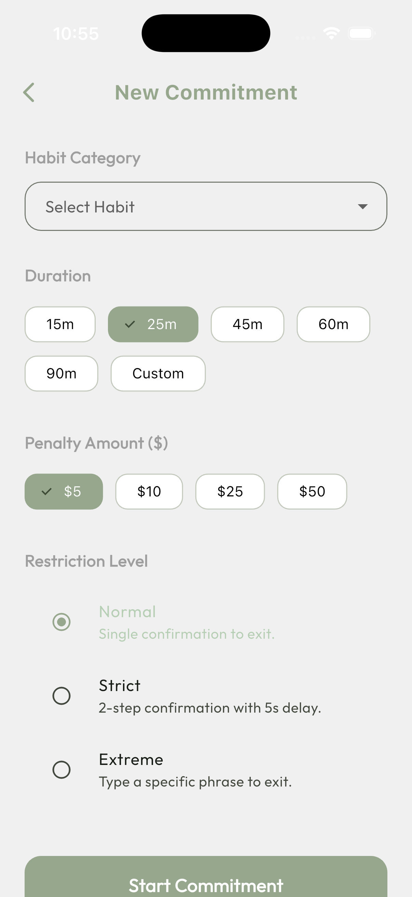
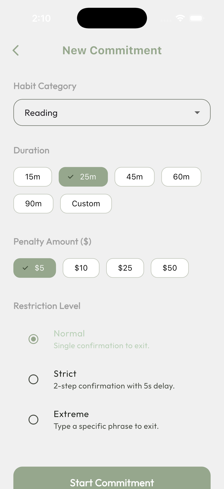
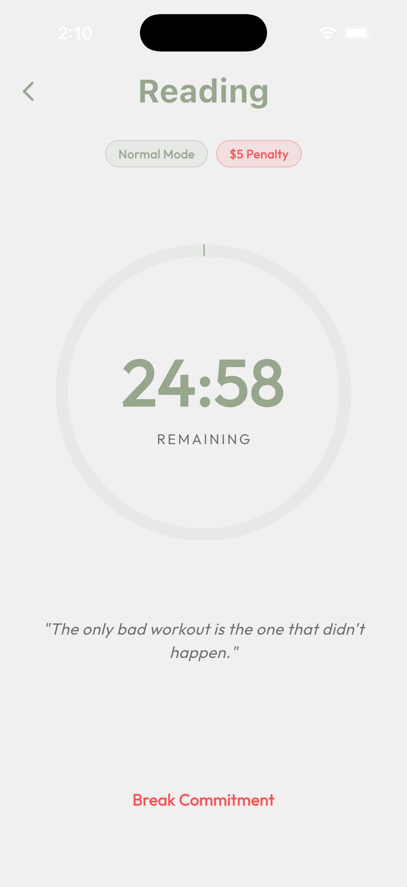
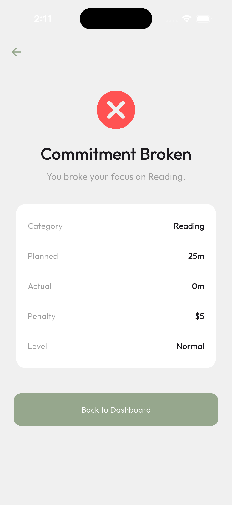
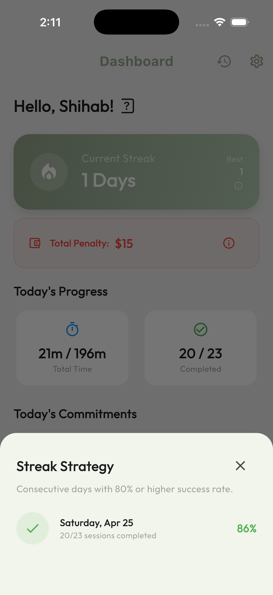
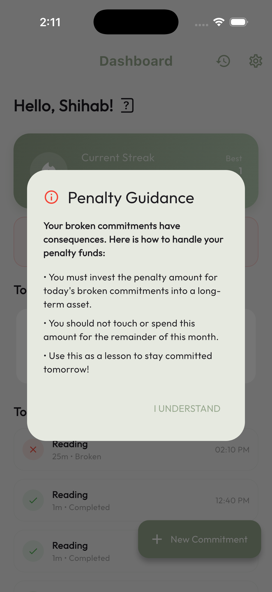
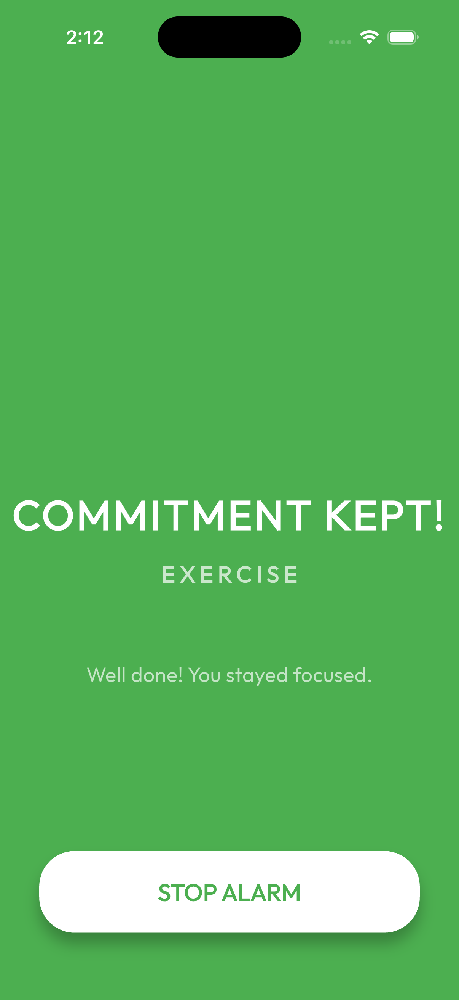
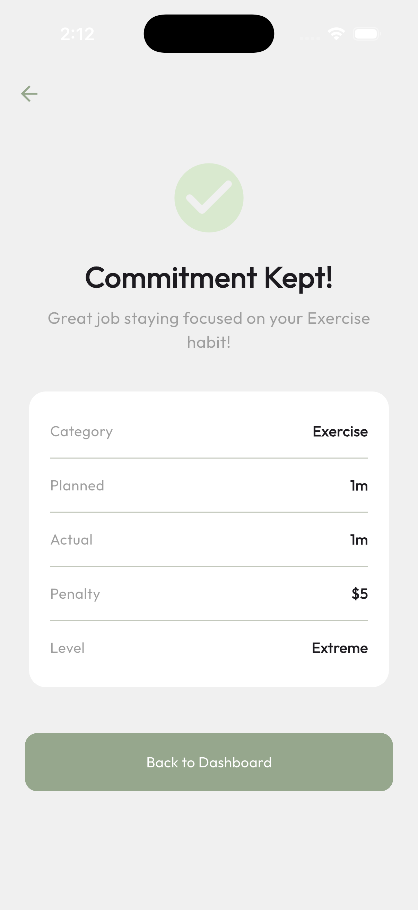

# CommitLock - Habit Accountability App

A Flutter-based habit tracking application that implements commitment-based accountability with timer sessions, local persistence, and lifecycle-aware state management.

## 📱 Screenshots

<div align="center">
  
  
  
  <br/>
  
  
  
  <br/>
  
  
  
</div>

---

## 🚀 Setup Instructions

### Prerequisites
- Flutter SDK: **3.16.0** or higher
- Dart SDK: **3.2.0** or higher
- Android Studio / Xcode (for respective platform builds)

### Installation Steps

1. **Clone the repository**
   ```bash
   git clone <repository-url>
   cd commitlock
   ```

2. **Install dependencies**
   ```bash
   flutter pub get
   ```

3. **Generate Hive type adapters**
   ```bash
   flutter packages pub run build_runner build --delete-conflicting-outputs
   ```

4. **Run the app**
   ```bash
   # For Android
   flutter run
   
   # For iOS
   flutter run -d ios
   ```

### Mock Login Credentials
The app uses mock authentication. You can login with:
- **Email/Mobile**: Any valid format (e.g., `test@example.com` or `9876543210`)
- **Password**: Any string with minimum 6 characters

---

## 🛠️ Tech Stack

### State Management: **Riverpod 2.x**

Chosen for its compile-time safety, better testability, and no dependency on BuildContext for global state access.

**Implementation approach:**
- `StateNotifierProvider` for complex state (active sessions, timer logic)
- `StateProvider` for simple UI state (theme, filters)
- `FutureProvider` for async data loading (history, stats)

**Key providers:**
```dart
// Session management
final sessionProvider = StateNotifierProvider<SessionNotifier, SessionState>

// Theme management
final themeProvider = StateProvider<ThemeMode>

// History data
final historyProvider = FutureProvider<List<CommitmentSession>>
```

### Local Database: **Hive**

Selected over Sqflite for its speed, simplicity, and zero-boilerplate approach for Flutter models.

**Storage structure:**
- **Box: `sessions`** - Stores all commitment session records
- **Box: `user_prefs`** - Stores app settings and user preferences
- **Box: `login_state`** - Persists authentication state

**Models stored:**
- `CommitmentSession` - Complete session data with timestamps
- `AppSettings` - Theme, notification preferences
- `UserLoginState` - Mock authentication state

---

## 🏗️ Architecture

The project follows **Clean Architecture** with a **feature-first** folder structure for better scalability and maintainability.

```
lib/
├── core/
│   ├── constants/          # App-wide constants, strings, and keys
│   ├── router/             # GoRouter configuration and route definitions
│   ├── services/           # Notification and background services
│   ├── theme/              # Material 3 theme configuration
│   └── utils/              # Helper functions and calculators
│
├── features/
│   ├── auth/
│   │   └── presentation/   # Login and Onboarding screens
│   │
│   ├── commitment/
│   │   ├── domain/         # Session model and status enums
│   │   └── presentation/   # Timer, New Commitment, and Alarm screens
│   │
│   ├── history/
│   │   └── presentation/   # History list and statistics
│   │
│   ├── home/
│   │   ├── domain/         # User statistics model
│   │   └── presentation/   # Dashboard and Active Session card
│   │
│   └── settings/
│       └── presentation/   # App settings and theme selection
│
└── main.dart               # App entry point and global providers
```

**Architectural benefits:**
- Clear separation of business logic from UI
- Easy to unit test individual layers
- Each feature is self-contained and can be modified independently
- Repository pattern allows easy switching of data sources

---

## ✅ Features Completed

### 1. Authentication
- [x] Email/mobile input with validation
- [x] Password input with show/hide toggle
- [x] Login button with loading state
- [x] Error handling for invalid inputs
- [x] Mock authentication logic
- [x] Persistent login state (survives app restarts)

### 2. Home Dashboard
- [x] User greeting with name
- [x] Current streak count (consecutive days with ≥1 completed session)
- [x] Today's committed time vs completed time
- [x] Active session card (displayed when session is running)
- [x] Quick action buttons: New Commitment, History, Settings
- [x] Real-time updates when sessions complete/break

### 3. New Commitment Screen
- [x] Habit category selection:
  - Reading, Exercise, Language Study, Coding Practice, Meditation, Custom
- [x] Duration selection:
  - Presets: 15, 30, 45, 60, 90 minutes
  - Custom duration input (with validation)
- [x] Penalty amount input (₹)
- [x] Restriction level selection: Normal, Strict, Extreme
- [x] Mock blocked app category selection
- [x] Data validation before session creation
- [x] All data persisted to Hive when session starts

### 4. Active Session Screen ⚡ (Core Feature)
- [x] **Countdown timer in MM:SS format**
- [x] Habit name and category display
- [x] Restriction level badge
- [x] Penalty amount display
- [x] Circular progress indicator
- [x] Motivational messages
- [x] "Attempt Exit" button with restriction-based confirmations

**Timer Implementation (Critical):**
- ✅ Uses **timestamp-based calculation** instead of `Timer.periodic()`
- ✅ Stores `startTimestamp` + `durationInMinutes` in Hive
- ✅ Calculates remaining time: `remaining = (start + duration) - now`
- ✅ **Survives app backgrounding** - timer continues accurately
- ✅ **Survives app kill** - recovers exact remaining time on restart
- ✅ **No timer drift** - always synced to actual time
- ✅ Auto-completes when duration expires (even if app was closed)

**Exit Confirmation Logic:**
- **Normal**: Single confirmation dialog ("Are you sure?")
- **Strict**: Two-step confirmation with 5-second mandatory wait
- **Extreme**: User must type exactly: `I am breaking my commitment`

### 5. Result Screen
- [x] Completion status (Completed/Broken) with icon
- [x] Habit category display
- [x] Planned duration vs actual duration
- [x] Restriction level
- [x] Penalty amount (marked as "Lost" or "Saved")
- [x] Updated streak count (if applicable)
- [x] Navigation buttons: Dashboard, History

### 6. History Screen
- [x] List of all past sessions with:
  - Date and time
  - Habit category
  - Planned vs actual duration
  - Status badge (Completed/Broken)
  - Penalty amount
- [x] **Filter options**: All / Completed / Broken
- [x] **Sort options**: Newest first / Oldest first
- [x] **Summary statistics**:
  - Total sessions
  - Success rate (%)
  - Total committed time
  - Total penalties lost
  - Total penalties saved
- [x] Empty state when no sessions exist

### 7. Settings Screen
- [x] Theme switcher: Light / Dark / System (persisted)
- [x] Sound toggle (on/off)
- [x] Completion notification toggle
- [x] Restriction level explanation section
- [x] Mock blocked app category toggles
- [x] Mock user info display
- [x] Logout functionality
- [x] Clear all history (with confirmation dialog)

---

## 🎯 Key Implementation Details

### Streak Calculation Logic

The streak represents **consecutive days** where the user completed at least one session successfully.

### Penalty System

The penalty acts as **psychological accountability** - no actual payment is processed.

**How it works:**
- User sets a penalty amount (e.g., ₹500) when creating a commitment
- If session is **completed**: Penalty is counted as "saved"
- If session is **broken**: Penalty is counted as "lost"
- Statistics show total penalties lost vs saved across all sessions

**Purpose:**
- Creates mental cost for breaking commitments
- Gamifies the accountability aspect
- Provides additional motivation beyond just tracking

---

## 📲 Platform Support & Testing

### Android
- **Tested on**: 
  - Emulator: Pixel 6 API 33 (Android 13)
- **Status**: ✅ Fully functional
- **Timer recovery**: Verified after app kill and restart

### iOS
- **Tested on**:
  - Simulator: iPhone 17 Pro Max
- **Status**: ✅ Fully functional

### iOS-Specific Setup

**1. Install CocoaPods dependencies:**
```bash
cd ios
pod install
cd ..
```

**3. Notification permissions:**
- App requests notification permissions on first launch
- Critical for timer completion alerts
- Users can manage in Settings > Notifications

**4. Building for iOS:**
```bash
# Debug build
flutter build ios --debug

# Release build (requires signing)
flutter build ios --release

# Generate IPA for distribution
flutter build ipa --release
```

### iOS Known Limitations

1. **Full-screen alarm on locked device**: 
   - iOS restricts full-screen interruptions
   - Completion shows as banner notification instead
   - Would require VOIP push notifications for production

2. **Background timer**:
   - iOS aggressively suspends background processes
   - Using timestamp-based calculation mitigates this
   - Timer recovers correctly when app reopens

3. **App blocking feature**:
   - Not implementable on iOS without MDM profiles
   - Mock UI only (as per requirements)


---

## 📝 Known Limitations

1. **No backend integration**:
   - All data is stored locally
   - No cloud sync between devices
   - Lost if app data is cleared

2. **Mock authentication**:
   - No real user accounts
   - Single-user app
   - No password recovery

3. **App blocking (both platforms)**:
   - Categories are UI-only
   - No actual app blocking implemented


4. **Notifications**:
   - Android: Works as expected
   - iOS: Shows as banner, not full-screen alarm on locked device

5. **Offline only**:
   - No network calls
   - No remote configuration
   - No social features

---

## 🧪 Testing Performed

### Manual Test Cases Verified

**Timer Lifecycle:**
- ✅ Timer continues accurately after app minimized 
- ✅ Timer recovers correct remaining time after force close
- ✅ Timer completes successfully when app is closed
- ✅ Multiple sessions can be created and completed
- ✅ No timer drift observed over long durations 

**Data Persistence:**
- ✅ Sessions persist after app restart
- ✅ Login state persists across app kills
- ✅ Theme preference persists
- ✅ Settings persist correctly
- ✅ History shows all past sessions

**Restriction Levels:**
- ✅ Normal: Single dialog confirmation works
- ✅ Strict: Two-step with 5-second delay enforced
- ✅ Extreme: Text input validation exact match required

**Edge Cases:**
- ✅ Creating session with custom duration
- ✅ Breaking session immediately after start
- ✅ History with 50+ sessions performs well
- ✅ Streak calculation with mixed completion/broken sessions
- ✅ Filtering and sorting in history

**Platform-specific:**
- ✅ Theme switching on both Android and iOS
- ✅ Notifications on both platforms
- ✅ Navigation and routing

---

## 📦 Dependencies

Key packages used:

```yaml
dependencies:
  flutter_riverpod: ^2.5.1         # State management
  hive: ^2.2.3                     # Local database
  hive_flutter: ^1.1.0             # Hive Flutter extensions
  go_router: ^14.2.0               # Declarative routing
  flutter_local_notifications: ^21.0.0 # High-priority alarms
  intl: ^0.19.0                    # Date/time formatting
  flutter_animate: ^4.5.0          # UI animations
  flutter_ringtone_player: ^4.0.0+4 # Native alarm sounds

dev_dependencies:
  build_runner: ^2.4.9             # Code generation
  hive_generator: ^2.0.1           # Hive adapters
  freezed: ^2.5.2                  # Model generation
  json_serializable: ^6.8.0        # JSON serialization
```

---

## 📄 License

This project was created as part of a technical assessment for a Flutter Developer position.

---

## 👨‍💻 Developer Notes

**Development approach:**
- Prioritized timer accuracy and lifecycle handling (core requirement)
- Used timestamp-based logic over periodic timers for reliability
- Focused on clean code structure for maintainability
- Handled all UI states (loading, error, success, empty)
- No hardcoded strings - using constants throughout
- Proper error handling in repositories
- Riverpod for predictable state management
- Feature-first architecture for scalability


Built with Flutter 💙